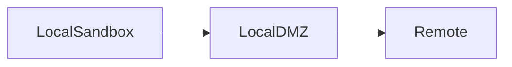
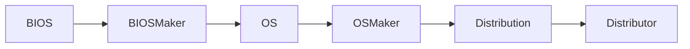

# secure-framework

## 価値

一般的に普及したOS上でのソフトウェア制御でマルウェアや不正アクセスを予防したり、
検出したりする状況に一石を投じたい。

自由度が先んじるソフトウェアの世界で、セキュリティを先んじるソフトウェアの世界を作りたい。

## 多層セキュリティフレームワーク

- Local DMZ in Machine
- DMZ based File System
- Local Sandbox
  - Local Sensitive Session

## 多層アクティベーション

## Auto Tracing

## Auto Notifying

## Auto Targeting, and Auto Counterattack

## Actor

- BIOS, and BIOS Maker
- OS, and OS Maker
- User

## Sensitive Information

- User
  - User Name
  - User MailAddress
  - User Log

